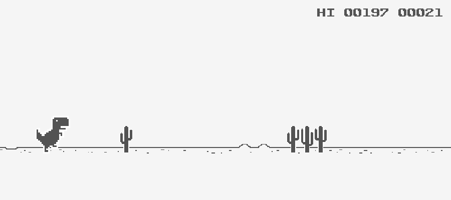

# Raylib Dino Game

A simple replica of the chrome://dino game made with raylib.

Ready to be built on Windows and MacOS.

[Watch the demo](https://drive.google.com/file/d/14-eKPgG3sINeTXVR2X5tBq8lOJClFghm/view?usp=sharing)

### Requirements

- C++ compiler
- [CMake](https://cmake.org/)
- raylib library (included)
- raylib C++ wrapper
